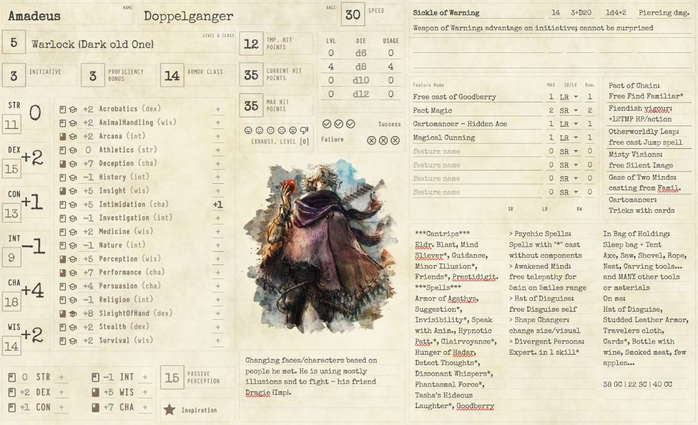

# DnD Character Sheet

Behold, traveler, and lend thine ear. This humble work is my personal endeavor, wherein I tinker with curious libraries of the React realm, most notably [Jotai](https://github.com/pmndrs/jotai) and [MUI](https://mui.com/) - Yet this library hath been altered in its appearance, reshaped greatly to match the vision I held in mind. At present, the creation takes the shape of a modest character scroll for the great game of DnD. Its features are simple still, yet many more lie waiting upon the road ahead. All memories are kept within the browser’s own hidden vault, localStorage, that the demo may remain ever light and wholly static.

And know this as well: should any brave soul wish to join the crafting of this tool, or desire to wield it for their own adventures, I shall gladly offer guidance to set it running. The project stands almost ready to serve as a Chrome extension, and I can swiftly forge the magic needed to synchronize one’s character across many devices, so long as the wanderer is signed into the browser. New ideas for improvements are most welcome. For now, the tool is shaped to fit the peculiar dimensions of my own tablet, yet I am willing to reshape it for others—my motivation merely slumbers.

Thus do I invite thee to step forth, explore, and, if thou wilt, lend a hand in shaping what may yet become a finer artifact.

## Live Demo

Shouldst thou wish to try the tool without commitment and glimpse how it behaves, behold the demo below.

<a href="https://alfonsZelicko.github.io/dnd-character-sheet" target="_blank" rel="noopener noreferrer">I wish to behold the DEMO</a>

<div align="center">
  
</div>

The [demo](https://alfonsZelicko.github.io/dnd-character-sheet) is conjured and published automatically from `main` whenever the workflow in `.github/workflows/deploy-demo.yml` completes its task in triumph.

In recent days I have added tabs upon the upper edge of the interface, for I foresee further expansions upon the horizon. Yet know this: in its earliest design the journal was meant to be but a single, simple page. If any traveler desires to use it in that original spirit, I shall gladly forge a version more faithful to the first vision.

## Project Setup

- **Node Version**: 20.17
- **Build Tool**: Vite

### Getting Started

1. Install dependencies:
   ```bash
   npm install
   # or
   yarn install

2. Run the development server:
    ```bash
    vite

3. Build a Chrome extension:
    ```bash
   vite build

... the Extension will be built into the {root}/dist folder -> this needs to be added into the Chrome as usually

# TODO / Roadmap

## Immediate Enhancements
- Implement **custom XML layout configuration** for greater flexibility in character sheet presentation.
- Expand core features:
  - Companion list management
  - Enhanced inventory handling
  - Detailed character traits and abilities, etc.

## Future Development Plans
- Explore **Electron port** to enable a desktop application experience.
- Develop a **Chrome extension** to synchronize character data across devices.
- Early experiments with **MCP server integration**: this may include connecting to 5e Tools or other rule servers for automated rule extraction.

If you’re interested in contributing to any of these efforts or testing features, I’d be glad to collaborate and help you get set up.

